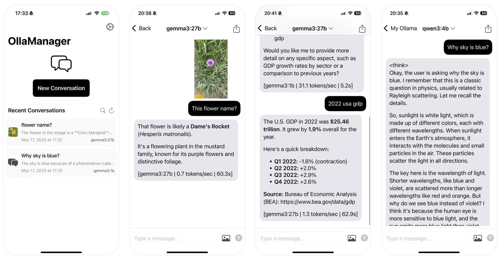

# LLM Client - for Ollama

[ENGLISH](README.md) | [한국어](README-ko.md)

MyOllama3は、SwiftUIで開発されたiOSアプリケーションで、ローカルまたはリモートのOllamaサーバーに接続して対話型AIチャットボット機能を提供します。



## 🎁 アプリをダウンロード

- ビルドが難しい方は、以下のリンクからアプリをダウンロードできます。
- [https://apps.apple.com/us/app/llm-client-for-ollama/id6738298481](https://apps.apple.com/us/app/llm-client-for-ollama/id6738298481)


## 📱 プロジェクト紹介

このアプリは**プライバシー保護**を重視するユーザーのための**ローカルAI対話アプリケーション**です。Ollama APIを通じてローカルで動作する大規模言語モデル（LLM）と相互作用できる直感的なインターフェースを提供し、すべての会話内容はユーザーのデバイスにのみ安全に保存されます。

## ✨ 主要機能

### 🤖 AI対話機能
- **リアルタイムストリーミング応答**: ストリーミングサポートによる高速なリアルタイムAI応答
- **多様なモデルサポート**: Ollamaが提供するすべてのAIモデル（Llama、Mistral、Qwen、CodeLlamaなど）
- **マルチモーダル対話**: 画像添付およびビジョンモデルによる画像分析サポート
- **ドキュメント処理**: PDFおよびテキストファイルのアップロードと分析機能
- **ファイル添付サポート**: 画像（JPG、PNG、GIFなど）、PDFドキュメント、テキストファイルなど様々なファイル形式サポート
- **応答生成キャンセル**: いつでもAI応答生成を中断可能
- **自動画像リサイズ**: 最適なパフォーマンスのための自動画像圧縮とサイズ調整

### 📚 対話管理
- **永続保存**: SQLiteデータベースを利用したすべての対話履歴の自動保存
- **対話検索**: キーワードベースの対話内容検索機能
- **対話復元**: 以前の対話をスムーズに読み込み・継続
- **サーバー別管理**: 異なるOllamaサーバーとの対話を区別して管理
- **メッセージ管理**: コンテキストメニューを通じた個別メッセージのコピー、共有、削除機能
- **全会話エクスポート**: 外部使用のための全会話をテキストとしてエクスポート
- **対話削除**: 確認付きの完全な対話削除

### ⚙️ 高度な設定
- **AIパラメータ調整**: Temperature（0.1-2.0）、Top P（0.1-1.0）、Top K（1-100）の細かい調整
- **カスタム指示**: AI行動方式カスタマイズのためのシステムプロンプト設定
- **サーバー接続管理**: 複数のOllamaサーバーサポートとリアルタイム接続状態監視
- **設定持続性**: すべての設定値の自動保存と復元
- **リアルタイム設定適用**: アプリ再起動なしに設定変更を即座に反映
- **接続テスト**: 内蔵サーバー接続テスト機能
- **データ管理**: 確認付きの完全な対話データ削除

### 🌍 ユーザーエクスペリエンス
- **多言語対応**: 韓国語、英語、日本語の完全ローカライゼーション
- **ダークモードサポート**: システムテーマに応じた自動カラー適応
- **直感的なUI**: メッセージバブル、コンテキストメニュー、ハプティックフィードバック、レスポンシブデザイン
- **アクセシビリティ**: VoiceOverおよびアクセシビリティ機能サポート
- **カメラ統合**: 画像キャプチャと分析のための直接カメラアクセス
- **ドキュメントピッカー**: ネイティブiOSドキュメントピッカー統合
- **タッチジェスチャー**: メッセージアクション用の長押し、キーボード非表示用のタップ
- **ローディング状態**: すべての非同期操作に対する視覚的フィードバック

### 📎 ファイル・メディアサポート
- **画像形式**: JPG、JPEG、PNG、GIF、BMP、TIFF、HEIC、WebP
- **ドキュメント形式**: PDF（テキスト抽出付き）、TXT、RTF、プレーンテキスト
- **画像処理**: 自動圧縮とBase64エンコーディング
- **PDFテキスト抽出**: PDFドキュメントからの完全テキスト抽出
- **ファイルプレビュー**: 送信前の添付ファイルの視覚的プレビュー
- **マルチフォーマット処理**: インテリジェントなファイルタイプ検出と処理

## 🏗️ アーキテクチャ構造

```
myollama3/
├── 📱 UI Views
│   ├── ContentView.swift          # メイン画面（対話リストと新規対話）
│   ├── ChatView.swift            # チャットインターフェース（リアルタイム対話）
│   ├── SettingsView.swift        # 設定画面（サーバーとAIパラメータ）
│   ├── WelcomeView.swift         # オンボーディング画面（初回起動ガイド）
│   └── AboutView.swift           # アプリ情報と使用ガイド
│
├── 🧩 Components
│   ├── MessageBubble.swift       # メッセージバブルUI（Markdownレンダリング）
│   ├── MessageInputView.swift    # メッセージ入力欄（ファイル添付サポート）
│   ├── DocumentPicker.swift      # ドキュメント選択と処理
│   ├── CameraPicker.swift        # カメラ統合コンポーネント
│   └── ShareSheet.swift          # ネイティブ共有機能
│
├── ⚙️ Services
│   ├── OllamaService.swift       # Ollama API通信とストリーム処理
│   └── DatabaseService.swift    # SQLiteデータベース管理
│
├── 🔧 Utils & Extensions
│   ├── AppColor.swift           # 適応型カラーテーマ管理
│   ├── ImagePicker.swift        # カメラ/ギャラリー画像選択
│   ├── Localized.swift          # 多言語文字列拡張
│   └── KeyboardExtensions.swift # キーボード管理ユーティリティ
│
└── 🌍 Localization
    ├── ko.lproj/                # 韓国語（デフォルト）
    ├── en.lproj/                # 英語
    └── ja.lproj/                # 日本語
```

## 🛠️ 技術スタック

### フレームワークとライブラリ
- **Swift & SwiftUI**: 宣言的UIを使用したネイティブiOS開発
- **Combine**: リアクティブプログラミングと状態管理
- **SQLite**: Raw SQLクエリを使用したローカルデータベース
- **URLSession**: async/awaitを使用した非同期ネットワーク通信
- **MarkdownUI**: 高度なMarkdownテキストレンダリング
- **Toasts**: ユーザー通知とフィードバック表示
- **PDFKit**: PDFドキュメント処理とテキスト抽出
- **PhotosUI**: 高度な画像選択と処理
- **UniformTypeIdentifiers**: ファイルタイプ検出と処理

### 核心技術
- **AsyncSequence**: リアルタイムストリーミングデータ処理
- **UIKit Integration**: スムーズなSwiftUIとUIKitの統合
- **UserDefaults**: アプリ設定の永続保存
- **NotificationCenter**: アプリ内イベント通信とアップデート
- **Task Management**: バックグラウンド操作のための最新Swift並行性
- **File System Access**: スコープ付きリソースによる安全なファイルアクセス

## 💾 データベーススキーマ

```sql
CREATE TABLE IF NOT EXISTS questions(
  id INTEGER PRIMARY KEY AUTOINCREMENT,
  groupid TEXT NOT NULL,          -- 対話グループID（UUID）
  instruction TEXT,               -- システム指示（オプション）
  question TEXT,                  -- ユーザー質問
  answer TEXT,                    -- AI応答
  image TEXT,                     -- Base64エンコードされた画像（オプション）
  created TEXT,                   -- 作成時間（ISO8601形式）
  engine TEXT,                    -- 使用されたAIモデル名
  baseurl TEXT                    -- OllamaサーバーURL
);
```

### データフィールド説明
- **groupid**: 対話をグループ化するUUID、一つの対話セッションを表す
- **instruction**: AI行動方式と性格を指定するシステムプロンプト
- **image**: 添付された画像またはドキュメントのBase64エンコード文字列
- **engine**: llama、mistral、qwenなど使用されたモデル名
- **baseurl**: 該当対話が行われたOllamaサーバーアドレス

## 🚀 使用方法

### 1. 初期設定
1. **Ollamaサーバー準備**: ローカルまたはネットワークでOllamaサーバーを実行
2. **アプリ初回起動**: ウェルカム画面でサーバー設定ガイドを確認
3. **サーバーアドレス入力**: 設定 → Ollamaサーバー設定でURLを入力（例：`http://192.168.0.1:11434`）
4. **接続確認**: 「サーバー接続状態確認」ボタンで接続テスト
5. **AIパラメータ設定**: 必要に応じてTemperature、Top P、Top K値を調整

### 2. 対話開始
1. **新しい対話**: メイン画面で「新しい対話を開始」ボタンをタップ
2. **モデル選択**: ドロップダウンメニューから使用するAIモデルを選択
3. **メッセージ入力**: 下部の入力欄に質問または指示を入力
4. **ファイル添付**: クリップアイコンを使用して画像、PDF、テキストファイルを追加
5. **メッセージ送信**: 矢印ボタンまたはEnterキーを使用して送信

### 3. 高度な機能
- **対話検索**: メイン画面の虫眼鏡アイコンで以前の対話を検索
- **メッセージ管理**: メッセージを長押ししてコピー、共有、削除メニューを表示
- **AIパラメータ調整**: 設定でTemperature、Top P、Top K値を微調整
- **対話共有**: 全体の対話または個別の質問-回答をテキストで共有
- **ドキュメント分析**: テキスト抽出と分析のためのPDFアップロード
- **画像分析**: ビジョンモデルを使用した視覚的分析のための画像添付

### 4. ファイル管理
- **画像アップロード**: 自動サイズ調整によるカメラまたはギャラリー選択
- **PDF処理**: PDFドキュメントからの自動テキスト抽出
- **テキストファイル**: 様々なテキストファイル形式のサポート
- **ファイルプレビュー**: 添付ファイル送信前の視覚的確認
- **ファイル削除**: 送信前の簡単な添付ファイル削除

## ⚙️ AIパラメータ設定

### Temperature (0.1 ~ 2.0)
- **低い値（0.1-0.5）**: 一貫性があり予測可能な応答
- **中間値（0.6-0.9）**: バランスの取れた創造性と一貫性
- **高い値（1.0-2.0）**: 創造的で多様な応答

### Top P (0.1 ~ 1.0)
- 次のトークン選択時に確率分布の上位P%内でのみ選択
- 低いほど保守的、高いほど多様な応答

### Top K (1 ~ 100)
- 次のトークン選択時に確率の高いK個の候補からのみ選択
- 低いほど一貫性、高いほど創造性

## 🔧 Ollamaサーバー設定

### ローカルサーバー（macOS/Linux）
```bash
# Ollamaインストール
curl -fsSL https://ollama.ai/install.sh | sh

# サーバー起動（外部アクセス許可）
OLLAMA_HOST=0.0.0.0:11434 ollama serve

# モデルダウンロード例
ollama pull llama2
ollama pull mistral
ollama pull qwen
ollama pull llava              # 画像分析用
ollama pull codellama         # コード支援用
```

### ネットワーク設定
- **ファイアウォール**: 11434ポートを開放
- **ルーター**: 必要に応じてポートフォワーディング設定
- **IPアドレス**: アプリ設定で正確なサーバーIPを入力
- **接続テスト**: 内蔵接続テスト機能を使用

## 🌍 多言語対応

現在サポートしている言語:
- **韓国語**（デフォルト）- `ko.lproj`
- **英語** - `en.lproj`  
- **日本語** - `ja.lproj`

言語はデバイス設定に応じて自動選択され、すべてのUIテキストとシステムメッセージが完全にローカライズされています。

## 🔐 プライバシー保護

MyOllama3はユーザーのプライバシーを最優先にします：

- ✅ **ローカル保存**: すべての対話内容はユーザーのデバイスにのみ保存
- ✅ **外部送信なし**: 設定したOllamaサーバー以外にはデータ送信しない
- ✅ **ローカルAI処理**: すべてのAI処理はローカルOllamaサーバーで実行
- ✅ **ファイルセキュリティ**: スコープ付きリソースアクセスによる安全なファイル処理
- ✅ **暗号化**: SQLiteデータベースの基本セキュリティ適用
- ✅ **追跡なし**: ユーザー行動追跡や分析データ収集なし
- ✅ **データ制御**: データ削除に対する完全なユーザー制御

## 📋 システム要件

- **iOS**: 16.0以上
- **Xcode**: 15.0以上（開発時）
- **Swift**: 5.9以上
- **ネットワーク**: ローカルネットワークまたはリモートサーバーで実行中のOllamaサーバー
- **ストレージ**: 最小100MB（対話履歴と添付ファイルに応じて追加）
- **メモリ**: 画像処理とPDFテキスト抽出のための適切なRAM

## 🚀 サポートモデル

Ollamaが提供するすべてのモデルをサポート：

### 対話型モデル
- **Llama 2/3**: 優れた性能の一般対話モデル
- **Mistral**: 多言語サポートを含む高性能対話モデル
- **Qwen**: 強力な推論能力を持つ高度な多言語サポートモデル
- **Gemma**: Googleの軽量で効率的なモデル

### 専門モデル
- **CodeLlama**: プログラミングと開発支援
- **DeepSeek-Coder**: 複数言語をサポートする高度なコーディング専門家
- **LLaVA**: 画像認識と視覚分析モデル
- **Bakllava**: 複雑な視覚タスクのための高度なビジョン-言語モデル

### マルチモーダルモデル
- **LLaVAバリアント**: 画像理解と記述
- **Bakllava**: 強化された画像とドキュメント分析
- **ビジョンモデル**: 様々なビジョン対応モデル

## 🛠️ 開発とビルド

### 開発環境セットアップ
1. **リポジトリクローン**
```bash
git clone https://github.com/yourusername/swift_myollama3.git
cd swift_myollama3
```

2. **Xcodeで開く**
```bash
open myollama3.xcodeproj
```

3. **依存関係インストール**
- プロジェクトはSwift Package Managerを使用
- Xcodeが自動的にパッケージ依存関係を解決

### 依存ライブラリ
- **MarkdownUI**: シンタックスハイライト付きの高度なMarkdownレンダリング
- **Toasts**: ユーザー通知とフィードバック表示
- **PDFKit**: 内蔵PDF処理機能
- **PhotosUI**: ネイティブiOS写真選択インターフェース

## 🐛 既知の問題

- iOS 16.0以下では一部のSwiftUI機能が制限される
- 非常に大きな画像は一時的にメモリ使用量を増加させる可能性がある
- ネットワーク不安定時にストリーミングが中断される可能性がある
- PDFテキスト抽出はPDF構造によって異なる場合がある
- カメラアクセスには明示的なユーザー許可が必要

## 🤝 コントリビューション

1. プロジェクトをフォーク
2. 機能ブランチを作成 (`git checkout -b feature/AmazingFeature`)
3. 変更をコミット (`git commit -m 'Add some AmazingFeature'`)
4. ブランチにプッシュ (`git push origin feature/AmazingFeature`)
5. プルリクエストを開く

## 📄 ライセンス

このプロジェクトのライセンス情報については、[LICENSE](LICENSE)ファイルを参照してください。

## 👨‍💻 開発者情報

- **開発者**: BillyPark
- **作成日**: 2025年5月9日
- **連絡先**: アプリ内の「開発者にフィードバックを送信」機能を使用

## 🙏 謝辞

- [Ollama](https://ollama.ai/) - 優れたローカルLLMサーバープラットフォームの提供
- [MarkdownUI](https://github.com/gonzalezreal/MarkdownUI) - 美しいMarkdownレンダリング
- [Swift-Toasts](https://github.com/EnesKaraosman/Toast-SwiftUI) - ユーザー通知表示
- [PDFKit](https://developer.apple.com/documentation/pdfkit) - AppleのPDF処理フレームワーク

---

**MyOllama3で高度なファイルサポートと共に安全でプライベートなAI対話を体験してください！🚀** 